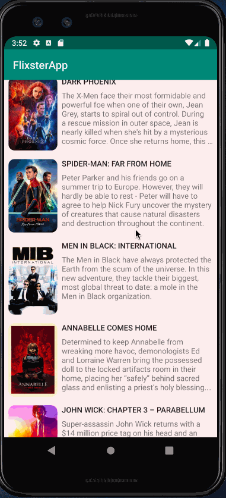

# Project 2 - FlixsterApp

FlixterApp shows the latest movies currently playing in theaters. The app utilizes the Movie Database API to display images and basic information about these movies to the user.

Time spent: **17** hours spent in total

## User Stories

The following **required** functionality is completed:

* [X] User can **scroll through current movies** from the Movie Database API

The following **stretch** features are implemented:

* [X] For each movie displayed, user can see the following details:
  * [X] Title, Poster Image, Overview (Portrait mode)
  * [X] Title, Backdrop Image, Overview (Landscape mode)
* [X] Display a nice default [placeholder graphic](https://guides.codepath.org/android/Displaying-Images-with-the-Glide-Library#advanced-usage) for each image during loading
* [X] (Added a light pink background, different title text) Improved the user interface by experimenting with styling and coloring.
* [X] Apply rounded corners for the poster or background images using [Glide transformations](https://guides.codepath.org/android/Displaying-Images-with-the-Glide-Library#transformations)

The following **additional** features are implemented:

* Cut off overviews after a certain number of lines and added "..." instead.
* Movie title is a button that takes you to another page. (This part is unfinished)

## Video Walkthrough

Here's a walkthrough of implemented user stories:

GIF created with [LiceCap](http://www.cockos.com/licecap/).

## Notes

My biggest challenge during this project was understanding the relationship between RecyclerView, the Adapter, and the layout. 

## Open-source libraries used

- [Android Async HTTP](https://github.com/loopj/android-async-http) - Simple asynchronous HTTP requests with JSON parsing
- [Glide](https://github.com/bumptech/glide) - Image loading and caching library for Android

## License

    Copyright [yyyy] [name of copyright owner]

    Licensed under the Apache License, Version 2.0 (the "License");
    you may not use this file except in compliance with the License.
    You may obtain a copy of the License at

        http://www.apache.org/licenses/LICENSE-2.0

    Unless required by applicable law or agreed to in writing, software
    distributed under the License is distributed on an "AS IS" BASIS,
    WITHOUT WARRANTIES OR CONDITIONS OF ANY KIND, either express or implied.
    See the License for the specific language governing permissions and
    limitations under the License.
